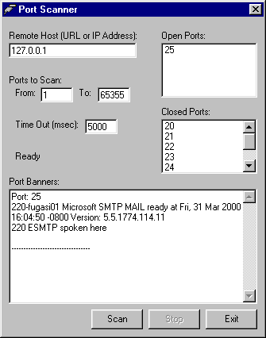



## vbPortScan

### Description

vbPortScan is a simple port scanning utility for footprinting the security of your system. You can choose a range of ports to scan, a local or remote ip address, and the software will return a list of open or closed ports. Also configurable is the timeout (wait) parameter.

This application also shows the use of the GetTickCount API call to demonstrate high resolution timers in Windows.

UPDATED: now vbPortScan will do a "banner grab" and return any information about an open port.
 
### More Info
 
I do not recommend running this or other port scanning programs on remote servers without the express written permission of the remote service.

             |
---                |---
**Submitted On**   |2000-03-28 16:01:48
**By**             |[Bill Olson](https://github.com/Planet-Source-Code/PSCIndex/blob/master/ByAuthor/bill-olson.md)
**Level**          |Intermediate
**User Rating**    |4.7 (14 globes from 3 users)
**Compatibility**  |VB 5\.0, VB 6\.0
**Category**       |[Miscellaneous](https://github.com/Planet-Source-Code/PSCIndex/blob/master/ByCategory/miscellaneous__1-1.md)
**World**          |[Visual Basic](https://github.com/Planet-Source-Code/PSCIndex/blob/master/ByWorld/visual-basic.md)
**Archive File**   |[CODE\_UPLOAD44413312000\.zip](https://github.com/Planet-Source-Code/bill-olson-vbportscan__1-6842/archive/master.zip)

